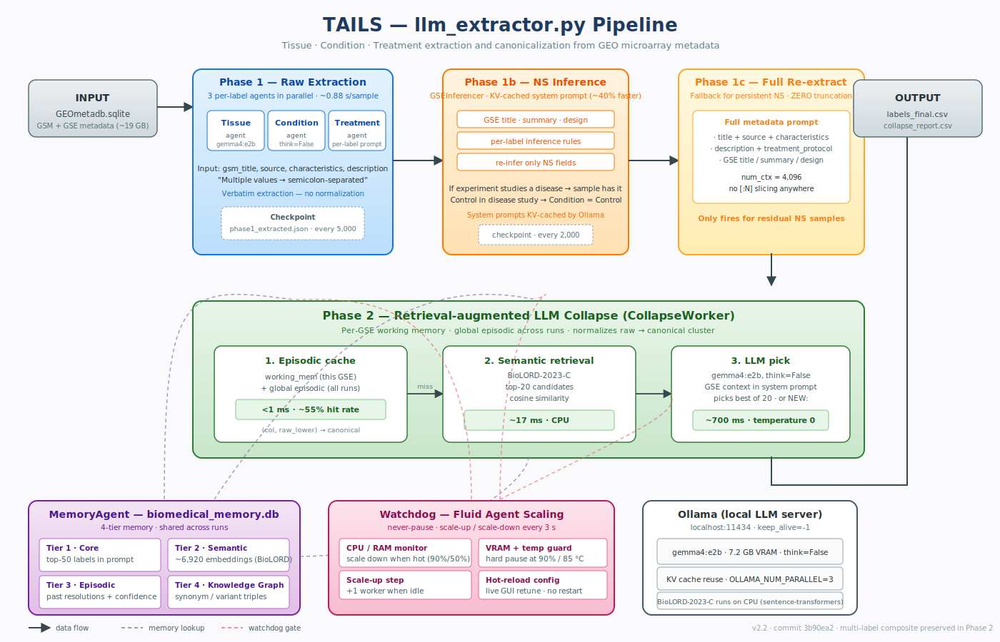

<p align="center">
  <br>
  
  <br><br>
  <strong>LLM-Label-Extractor</strong><br>
  <em>Multi-agent pipeline for extracting and normalizing biomedical metadata labels from GEO microarray data</em>
</p>

<p align="center">
  <a href="#-license-1"></a>
  
  
  
  
  
  
  
</p>

---

## Overview

**LLM-Label-Extractor** is a multi-agent pipeline that extracts and normalizes **Tissue**, **Condition**, and **Treatment** metadata labels from [Gene Expression Omnibus (GEO)](https://www.ncbi.nlm.nih.gov/geo/) microarray data using local LLMs. It runs entirely offline via [Ollama](https://ollama.com/) -- no API keys, no cloud, no data leaves your machine.

**New in v2.2:** Complete pipeline overhaul — gemma4:e2b as sole model, Phase 1c (zero char limits), multi-value extraction (semicolons), coded value interpretation (0/1/Y/N), BioLORD-2023 retrieval collapse with per-GSE working memory, configurable num_ctx for HPC clusters.

---

## Features

| | Feature | Description |
|---|---|---|
| :brain: | **Retrieval-Augmented Collapse** | BioLORD-2023 semantic retrieval + LLM reasoning for label normalization (2025 SOTA pattern) |
| :robot: | **Multi-Agent Swarm** | One GSEWorker agent per experiment, parallel across all available hardware |
| :bar_chart: | **Fluid Worker Scaling** | Auto-scales 4--210 workers based on real-time CPU, RAM, and GPU utilization |
| :microscope: | **3-Phase Pipeline** | Extract, Infer, Collapse -- progressively refined label assignment |
| :zap: | **Per-Label Agents** | 3 independent LLM agents (Tissue, Condition, Treatment) run in parallel per sample |
| :desktop_computer: | **Dark-Theme GUI** | Modern tkinter interface with per-phase progress bars and live resource monitoring |
| :keyboard: | **HPC / CLI Mode** | `run_cluster.py` for servers, SLURM clusters, and batch processing |
| :dna: | **Multi-Species Support** | Homo sapiens, Mus musculus, Rattus norvegicus, and 8 more organisms |
| :lock: | **Fully Local** | All inference runs on your hardware via Ollama -- zero data exfiltration |

---

## Architecture

<p align="center">
  
</p>

<details>
<summary><b>📊 Interactive workflow diagram (click to expand) — renders natively on GitHub</b></summary>



```mermaid
flowchart LR
    %% ── Styling ──
    classDef input    fill:#ECEFF1,stroke:#546E7A,stroke-width:2px,color:#263238
    classDef phase1   fill:#E3F2FD,stroke:#1976D2,stroke-width:2px,color:#0D47A1
    classDef phase1b  fill:#FFF3E0,stroke:#F57C00,stroke-width:2px,color:#E65100
    classDef phase1c  fill:#FFF8E1,stroke:#F9A825,stroke-width:2px,color:#F57F17
    classDef phase2   fill:#E8F5E9,stroke:#2E7D32,stroke-width:2px,color:#1B5E20
    classDef memory   fill:#F3E5F5,stroke:#7B1FA2,stroke-width:2px,color:#4A148C
    classDef watchdog fill:#FCE4EC,stroke:#C2185B,stroke-width:2px,color:#880E4F
    classDef output   fill:#ECEFF1,stroke:#546E7A,stroke-width:2px,color:#263238
    classDef llm      fill:#FFFFFF,stroke:#455A64,stroke-width:1.5px,color:#263238

    IN["📥 INPUT<br/>GEOmetadb.sqlite<br/>GSM + GSE metadata"]:::input

    subgraph P1 ["🔬 Phase 1 — Raw Extraction · ~0.88 s/sample"]
        direction TB
        P1_T["🧫 Tissue agent"]:::llm
        P1_C["🦠 Condition agent"]:::llm
        P1_R["💊 Treatment agent"]:::llm
        P1_NOTE["Verbatim · multi-value semicolons · no normalization"]
    end
    class P1 phase1

    CP1["💾 phase1_extracted.json · checkpoint every 5,000"]:::input

    subgraph P1b ["🔍 Phase 1b — NS Inference · KV-cached system prompt (~40% faster)"]
        direction TB
        P1b_GSE["GSE title · summary · design injected"]
        P1b_RULES["Disease study → sample has it · Control → Condition = Control"]
    end
    class P1b phase1b

    subgraph P1c ["🧬 Phase 1c — Full Re-extraction · ZERO truncation · num_ctx=4096"]
        direction TB
        P1c_FULL["Full metadata + GSE context · no [:N] slicing"]
        P1c_NOTE["Fires only for residual NS samples"]
    end
    class P1c phase1c

    subgraph P2 ["⚡ Phase 2 — Retrieval-augmented LLM Collapse (CollapseWorker)"]
        direction LR
        P2_CACHE["1️⃣ Episodic cache<br/>&lt;1 ms · ~55% hit<br/>working_mem + global"]:::llm
        P2_BIO["2️⃣ BioLORD-2023-C<br/>top-20 candidates<br/>~17 ms · CPU"]:::llm
        P2_LLM["3️⃣ LLM pick<br/>gemma4:e2b think=False<br/>~700 ms · temp=0"]:::llm
        P2_CACHE -->|"miss"| P2_BIO
        P2_BIO --> P2_LLM
    end
    class P2 phase2

    OUT["📤 OUTPUT<br/>labels_final.csv<br/>collapse_report.csv"]:::output

    MEM[("🧠 MemoryAgent<br/>biomedical_memory.db<br/>4-tier · ~6,920 embeddings")]:::memory
    WD(("🐕 Watchdog<br/>fluid scaling<br/>CPU/RAM/GPU/temp"))
    class WD watchdog

    %% Flow
    IN --> P1 --> CP1 --> P1b --> P1c --> P2 --> OUT

    %% Memory connects to extraction, inference, collapse
    MEM -.memory lookup.-> P1
    MEM -.memory lookup.-> P1b
    MEM -.memory lookup.-> P2
    P2 -.persist episodic.-> MEM

    %% Watchdog throttles agents
    WD -.scale gate.-> P1
    WD -.scale gate.-> P1b
    WD -.scale gate.-> P2
```

**Legend:**
- **Solid arrows** = data flow through the pipeline
- **Dashed arrows** = cross-cutting concerns (memory lookups, watchdog throttling)
- **Rounded boxes** = LLM-backed agents
- **Database icon** = persistent 4-tier memory (shared across all runs)

</details>

---

## Agent Workflow

The pipeline uses a **multi-agent swarm** where each GEO experiment (GSE) is handled by an independent worker agent. Here is the step-by-step workflow:

1. **Platform Discovery** -- The pipeline queries `GEOmetadb.sqlite` to find all GPL platforms matching the user's species, technology, and minimum sample filters.

2. **GSE Queue Build** -- For each discovered platform, all associated GSE experiments and their GSM samples are queued for processing.

3. **Phase 1: Extract** -- Worker agents are spawned in parallel (4--210 concurrent). Each agent runs **3 independent per-label LLM calls** (Tissue, Condition, Treatment) in parallel:
   - Reads the GSM sample title, characteristics, and description
   - Reads the parent GSE experiment summary for context
   - Each label has its own domain-specific extraction prompt
   - With `gemma4:e2b`: uses `think=false` to disable chain-of-thought for speed
   - Labels with insufficient information are marked `Not Specified`
   - Results are checkpointed every 5,000 samples

4. **Phase 1b: Infer** -- For fields still marked `Not Specified`, the pipeline re-infers labels from the full GSE experiment description. Each label column has its own per-label inference agent with GSE context as a KV-cached system prompt.

5. **Phase 1c: Full Re-extract** -- Samples STILL `Not Specified` after Phase 1b are re-processed with **zero character limits** on all metadata fields and `num_ctx=4096`. This ensures no information loss for the hardest cases where disease/tissue info appears deep in the metadata text.

6. **Phase 2: Collapse** -- Retrieval-augmented LLM reasoning normalizes raw labels to canonical clusters:
   - **Step 1: Episodic cache** -- If this raw label was resolved before, return the cached result instantly (<1ms). Handles ~55% of labels on typical platforms.
   - **Step 2: Semantic retrieval** -- Embed the raw label with [BioLORD-2023](https://huggingface.co/FremyCompany/BioLORD-2023-C) (biomedical SOTA, runs on CPU), find the top-20 most similar canonical clusters from the vocabulary DB via cosine similarity (~17ms).
   - **Step 3: LLM reasoning** -- `gemma4:e2b` (`think=false`) picks the best canonical cluster from the 20 candidates (~700ms). The LLM preserves specificity (e.g., "Cerebral Cortex" stays as-is, not collapsed to "Brain") while normalizing naming and stripping qualifiers.
   - Results are checkpointed every 1,000 samples

   > **Key design rule:** The collapse preserves specificity -- subtissues, cell types, and cell lines keep their specific canonical names. The LLM only normalizes naming ("HL-60 cell" → "Cell Line: Hl-60 Cells"), strips qualifiers ("Normal Liver" → "Liver"), and expands abbreviations ("AD" → "Alzheimer Disease").

6. **Output** -- Per-platform CSV files are written with repaired labels, full annotations, and collapse reports.

---

## Minimum Requirements

| Resource | Minimum | Recommended |
|---|---|---|
| **CPU** | 4 cores | 8+ cores |
| **RAM** | 8 GB | 16+ GB |
| **Disk** | 25 GB free | 50+ GB free |
| **GPU** | 8+ GB VRAM | 12+ GB VRAM |
| **OS** | Linux, macOS, or Windows 10+ | Ubuntu 22.04+ / macOS 13+ |
| **Python** | 3.8+ | 3.10+ |
| **Ollama** | Latest stable | Latest stable |
| **Model** | gemma4:e2b (7.2 GB VRAM) | gemma4:e2b |


---

## Installation & Setup

### Prerequisites

- **Python 3.8+**
- **Ollama** (local LLM runtime)
- **GEOmetadb.sqlite** (~19 GB, downloaded separately)

### 1. Clone the Repository

```bash
git clone https://github.com/SciSpectator/LLM-Label-Extractor.git
cd LLM-Label-Extractor
```

### 2. Create a Virtual Environment (Recommended)

Using a virtual environment keeps dependencies isolated and avoids conflicts with system packages.

```bash
# Create virtual environment
python3 -m venv venv

# Activate it
source venv/bin/activate        # Linux / macOS
# OR
.\venv\Scripts\activate          # Windows
```

> **Note:** You must activate the virtual environment every time you open a new terminal before running the pipeline.

### 3. Install Python Dependencies

```bash
pip install -r requirements.txt
```

### 4. Install Ollama & Pull the Model

#### Ubuntu / Debian

```bash
# System dependencies
sudo apt update && sudo apt install -y python3 python3-pip python3-tk

# Install Ollama
curl -fsSL https://ollama.com/install.sh | sh

# Pull the default model
ollama pull gemma4:e2b

```

#### macOS

```bash
# Homebrew + Python
brew install python python-tk

# Install Ollama
brew install ollama

# Start Ollama service
ollama serve &

# Pull the default model
ollama pull gemma4:e2b

```

#### Windows

```powershell
# Install Python (via winget or chocolatey)
winget install Python.Python.3.11
# OR: choco install python

# Install Ollama
winget install Ollama.Ollama
# OR download from https://ollama.com/download/windows

# Pull the default model
ollama pull gemma4:e2b

```

### 5. Download GEOmetadb

The pipeline requires the GEOmetadb SQLite database (~19 GB) from NCBI.

#### Linux / macOS

```bash
# Method 1: Direct download
wget https://gbnci.cancer.gov/geo/GEOmetadb.sqlite.gz

# Method 2: Via R/Bioconductor
Rscript -e 'library(GEOmetadb); getSQLiteFile()'

# Decompress
gunzip GEOmetadb.sqlite.gz

# Place in the project root
mv GEOmetadb.sqlite /path/to/LLM-Label-Extractor/
```

#### Windows

```powershell
# Method 1: Download with PowerShell
Invoke-WebRequest -Uri "https://gbnci.cancer.gov/geo/GEOmetadb.sqlite.gz" -OutFile "GEOmetadb.sqlite.gz"

# Method 2: Via R/Bioconductor (if R is installed)
Rscript -e "library(GEOmetadb); getSQLiteFile()"

# Decompress using 7-Zip (install from https://www.7-zip.org if needed)
7z x GEOmetadb.sqlite.gz

# OR decompress using Python (no extra tools needed)
python -c "import gzip, shutil; shutil.copyfileobj(gzip.open('GEOmetadb.sqlite.gz','rb'), open('GEOmetadb.sqlite','wb'))"

# Move to the project root
move GEOmetadb.sqlite C:\path\to\LLM-Label-Extractor\
```

> **Note:** The pipeline will automatically detect either `GEOmetadb.sqlite` or `GEOmetadb.sqlite.gz` in the project directory.

### 6. Verification (Optional but Recommended)

```bash
# Verify Ollama is running
ollama ps

# Verify model is available
ollama list

# Test a quick run
python run_gui.py
```

---

## Quick Start

### GUI Mode

```bash
python run_gui.py
```

1. Select the **GEOmetadb.sqlite** file path
2. Choose **Species** (any organism available in GEOmetadb)
3. Choose **Technology** (any platform technology available in GEOmetadb)
4. Select **LLM Model** -- `gemma4:e2b` is the default
5. Select **Phases** -- check/uncheck Phase 1, 1b, 1c, 2 as needed
6. Click **Start** -- the pipeline will discover platforms and process each through selected phases

### CLI / HPC Batch Mode (`run_cluster.py`)

The CLI runner is designed for headless servers, HPC/SLURM clusters, and SSH sessions. All configuration is via environment variables.

```bash
# Basic usage (all phases, all platforms)
python run_cluster.py

# Specific platforms only
PLATFORM_ONLY=GPL570,GPL96 python run_cluster.py

# Select phases to run
PHASES=1,1b,1c    python run_cluster.py   # extract only, no collapse
PHASES=1           python run_cluster.py   # Phase 1 only
PHASES=2           python run_cluster.py   # collapse only (needs checkpoint)
PHASES=1,1b,1c,2   python run_cluster.py   # all phases (default)

# HPC with fake_ollama_lb (llama_cpp backend)
USE_FAKE_OLLAMA=1 OLLAMA_URL=http://localhost:8080 python run_cluster.py

# Platform range for parallel SLURM jobs
PLATFORM_START=0 PLATFORM_END=100 python run_cluster.py     # job 1
PLATFORM_START=100 PLATFORM_END=200 python run_cluster.py   # job 2

# Override worker count
NUM_WORKERS=8 python run_cluster.py
```

**Environment variables:**

| Variable | Default | Description |
|---|---|---|
| `PHASES` | `1,1b,1c,2` | Comma-separated phases to run |
| `PLATFORM_ONLY` | (all) | Comma-separated GPL IDs |
| `PLATFORM_START` | 0 | Start index for platform range |
| `PLATFORM_END` | 99999 | End index for platform range |
| `SKIP_GPLS` | (none) | Comma-separated GPL IDs to skip |
| `NUM_WORKERS` | auto | Override worker count |
| `USE_FAKE_OLLAMA` | 0 | Set to 1 for fake_ollama_lb backend |
| `OLLAMA_URL` | `http://localhost:11434` | Ollama API endpoint |
| `HARMONIZED_DIR` | `./NEW_RESULTS` | Output directory |
| `GEODB_PATH` | `./GEOmetadb.sqlite` | Path to GEOmetadb |

The runner auto-discovers all GPL platforms, skips already-completed ones, and resumes from checkpoints.

### Selecting Specific Platforms

```bash
# Single platform
PLATFORM_ONLY=GPL570 python run_cluster.py

# Multiple platforms
PLATFORM_ONLY=GPL570,GPL96,GPL6244 python run_cluster.py
```

Or from Python:

```python
import llm_extractor as G
import queue

q = queue.Queue()

# Process a single platform
config = {
    "db_path":        "GEOmetadb.sqlite",
    "platform":       "GPL570",             # specific GPL ID
    "model":          "gemma4:e2b",
    "extraction_model": "gemma4:e2b",
    "ollama_url":     "http://localhost:11434",
    "harmonized_dir": ".",
    "limit":          None,
    "num_workers":    20,
    "skip_install":   True,
    "gsm_list_file":  "",
    "server_proc":    None,
}
G.pipeline(config, q)

# Or process multiple platforms at once
config["platforms"] = [
    ("GPL570", "Affymetrix HG-U133 Plus 2.0", 90000),
    ("GPL6244", "Affymetrix HuGene 1.0 ST", 38328),
]
config["platform"] = config["platforms"][0][0]
G.pipeline_multi(config, q)
```

#### How gemma4:e2b Differs

The `gemma4:e2b` model (Google Gemma 4, 2B Edge) brings several improvements:

1. **Per-label extraction prompts** -- Each label (Tissue, Condition, Treatment) has its own domain-specific prompt instead of a single combined prompt. This reduces cross-label contamination.

2. **`think=false` mode** -- Gemma 4 models support a reasoning chain that generates internal "thinking" tokens before answering. Disabling this with `think=false` gives the same accuracy at ~50x faster speed for extraction tasks.

3. **Tight context window** -- Uses `num_ctx=512` (only the metadata needed per call), reducing memory overhead per request.

4. **Per-label collapse prompts** -- Phase 2 collapse also uses focused per-label prompts with candidate lists and sibling context.

#### Running on HPC / SLURM

For HPC environments, make sure Ollama is running on the compute node (or accessible via a forwarded port), then submit as a standard job:

```bash
#!/bin/bash
#SBATCH --job-name=llm-label
#SBATCH --cpus-per-task=8
#SBATCH --mem=32G
#SBATCH --time=48:00:00

# Load modules (adjust for your cluster)
module load python/3.10

# Activate virtual environment
source /path/to/LLM-Label-Extractor/venv/bin/activate

# Start Ollama if not running as a service
ollama serve &
sleep 5

# Run the pipeline
python run_cluster.py
```

#### Long-Running Sessions

For long runs over SSH, use `screen` or `tmux` to keep the process alive after disconnecting:

```bash
# Start a persistent session
tmux new -s llm-extract

# Inside tmux: activate venv and run
source venv/bin/activate
python run_cluster.py

# Detach: Ctrl+B then D
# Reattach later: tmux attach -t llm-extract
```

#### Monitoring Progress

Monitor progress in a separate terminal:

```bash
bash monitor.sh
```

---

## GUI Walkthrough

The GUI features a modern dark theme with the following panels:

| Panel | Description |
|---|---|
| **Configuration** | Database path, species, technology, model URL |
| **Model & Workers** | LLM model selection (`gemma2:2b` / `gemma4:e2b`), worker count |
| **Platform Queue** | Discovered platforms with sample counts, processing status |
| **Phase Progress** | Individual progress bars for Phase 1, Phase 1b, and Phase 2 |
| **Resource Monitor** | Real-time CPU, RAM, GPU utilization and worker count |
| **Live Log** | Scrolling log of agent activity, label assignments, and errors |

---

## Pipeline Phases

### Phase 1: Extract

Raw label extraction from GSM sample metadata and GSE experiment context. Each GSM record is processed by **3 independent per-label agents** running in parallel:

- **Tissue Agent** -- Extracts anatomical tissue, cell type, cell line, or organ
- **Condition Agent** -- Extracts disease state, phenotype, diagnosis, smoking status
- **Treatment Agent** -- Extracts drugs, compounds, procedures, stimuli (the GEO `treatment_protocol` field is excluded from this agent's input to prevent lab processing methods from being misclassified as treatments)

Each agent has its own domain-specific prompt optimized for its label type.

- **Parallelism:** Fluid worker pool (4--210 concurrent agents)
- **Speed:** ~174 ms/sample (gemma2:2b) or ~0.88s/sample (gemma4:e2b)
- **Checkpoints:** Every 5,000 samples

### Phase 1b: Infer

For fields still marked `Not Specified` after Phase 1, the pipeline re-infers labels using per-label GSE inference agents. Each label column has its own system prompt with experiment context, KV-cached by Ollama for speed.

### Phase 2: Collapse

Raw extracted labels are normalized to canonical cluster names via the 4-tier Memory Agent. The cluster map files contain pre-curated biomedical term groupings:

| Category | Cluster File | Clusters |
|---|---|---|
| Tissue | `LLM_memory/Tissues_clusters_db_ready.txt` | 1,512 |
| Condition | `LLM_memory/Conditions_clusters_db_ready.txt` | 2,689 |
| Treatment | `LLM_memory/treatment_clusters_db_ready.txt` | 2,719 |

**Key rule:** A label extracted in Phase 1 is **never collapsed back to Not Specified**. If the cluster gate finds no matching cluster, it registers the label as a new cluster automatically. This ensures that valid but rare labels (e.g., disease abbreviations like FTD, PBC) are preserved rather than discarded.

**Checkpoints:** Every 1,000 samples

---

## Memory System

The 4-tier memory system (`biomedical_memory.db`) ensures consistent label normalization across millions of samples:

### Tier 1: Core Memory (Cluster Map)
The top-50 most frequent labels are injected into every LLM prompt as few-shot examples, ensuring the most common terms are always resolved without retrieval.

### Tier 2: Semantic Memory
~6,920 biomedical labels are embedded as vectors. At resolution time, the raw label is embedded and matched to the nearest cluster via cosine similarity.

### Tier 3: Episodic Memory
Every past label resolution is logged with confidence scores. When the same raw label appears again, the cached resolution is returned instantly.

### Tier 4: Knowledge Graph
Synonym and variant relationships stored as triples in SQLite (e.g., `"liver" -> IS_A -> "Liver"`, `"hepatic tissue" -> SYNONYM -> "Liver"`). This handles abbreviations, alternative spellings, and domain-specific naming conventions.

**Resolution priority:** Episodic > Knowledge Graph > Semantic + LLM > Deterministic rules

---

## Fluid Worker Scaling

The pipeline dynamically adjusts its concurrency based on real-time system metrics:

| Metric | Low Utilization | High Utilization |
|---|---|---|
| CPU | Scale up workers | Scale down |
| RAM | Scale up workers | Scale down |
| GPU VRAM | Scale up workers | Scale down |
| **Range** | **4 workers (min)** | **210 workers (max)** |

The scaler samples system metrics every few seconds and adjusts the thread pool size to maximize throughput without causing OOM kills or GPU memory exhaustion.

---

## Input / Output

### Input

- **GEOmetadb.sqlite** -- the full GEO metadata database from NCBI (~19 GB)
- **Existing CSV files** (optional) -- previously annotated platform files for NS-repair mode

### Output (per platform)

| File | Description |
|---|---|
| `{GPL}_NS_repaired.csv` | Samples that had `Not Specified` labels repaired |
| `{GPL}_full_repaired.csv` | Complete annotated sample table |
| `{GPL}_collapse_report.csv` | Mapping of raw labels to collapsed cluster names |

---

## Supported Species

The pipeline supports **all organisms available in GEOmetadb**, including but not limited to:

| Species | Common Name | GEO Platforms |
|---|---|---|
| Homo sapiens | Human | 4,000+ |
| Mus musculus | Mouse | 2,000+ |
| Rattus norvegicus | Rat | 500+ |
| Drosophila melanogaster | Fruit fly | 200+ |
| Danio rerio | Zebrafish | 100+ |
| Caenorhabditis elegans | Nematode | 50+ |
| Saccharomyces cerevisiae | Yeast | 100+ |
| Arabidopsis thaliana | Thale cress | 100+ |
| Sus scrofa | Pig | 50+ |
| Bos taurus | Cattle | 50+ |
| Gallus gallus | Chicken | 30+ |

> **Note:** Any species present in GEOmetadb can be selected. The table above shows commonly used organisms. The full list is dynamically queried from the database at runtime.

## Supported Technologies

The pipeline supports **all platform technologies catalogued in GEOmetadb**. Common categories include:

| Technology | Example Array Types |
|---|---|
| Expression Microarray | in situ oligonucleotide, spotted DNA/cDNA, spotted oligonucleotide, oligonucleotide beads |
| RNA-Seq | high-throughput sequencing |
| Methylation Array | methylation profiling by array |
| SNP/Genotyping | SNP genotyping by array, genotyping by array |
| miRNA | miRNA profiling by array |
| All Technologies | no filter (processes all platforms) |

> **Note:** Technology categories are queried directly from GEOmetadb. As NCBI adds new platform types, they become automatically available.

---

## Configuration

Key configuration is set at runtime in the GUI or at the top of `run_cluster.py`:

| Parameter | Default | Description |
|---|---|---|
| `SPECIES` | `Homo sapiens` | Target organism (any species in GEOmetadb) |
| `TECH_MODE` | `Expression Microarray` | Platform technology filter (any technology in GEOmetadb) |
| `MODEL` | `gemma4:e2b` | Ollama model name (`gemma4:e2b` or `gemma2:2b`) |
| `EXTRACTION_MODEL` | `gemma4:e2b` | Model for per-label extraction agents (can differ from collapse model) |
| `OLLAMA_URL` | `http://localhost:11434` | Ollama API endpoint |

---

## Troubleshooting

### Ollama not running

```
ConnectionError: Cannot connect to Ollama at http://localhost:11434
```

**Fix:** Start the Ollama service:
```bash
ollama serve      # foreground
# OR
systemctl start ollama   # systemd (Linux)
```

### Model not found

```
Error: model "gemma4:e2b" not found
```

**Fix:** Pull the model:
```bash
ollama pull gemma4:e2b
```

### GEOmetadb not found

```
FileNotFoundError: GEOmetadb.sqlite not found
```

**Fix:** Download and place in the project directory. See [Download GEOmetadb](#5-download-geometadb).

### Out of memory during Phase 2

The collapse phase loads cluster files into memory. If you run out of RAM:
- Reduce worker count manually
- Close other applications
- The fluid scaler will automatically reduce workers on high memory pressure

### GPU VRAM insufficient for gemma4:e2b

```
Error: model requires more VRAM than available
```

**Fix:** Switch to `gemma2:2b` which requires only 2 GB VRAM, or free GPU memory by closing other applications. The pipeline will also run on CPU if no GPU is available (slower but functional).

### tkinter not available (Linux)

```
ModuleNotFoundError: No module named 'tkinter'
```

**Fix:**
```bash
sudo apt install python3-tk    # Debian/Ubuntu
sudo dnf install python3-tkinter  # Fedora
```

### GPU not detected

Ollama automatically uses GPU if available. Verify with:
```bash
ollama ps       # shows running models and GPU layers
nvidia-smi      # NVIDIA GPU status
```

---

## Contributing

Contributions are welcome! Please see [CONTRIBUTING.md](CONTRIBUTING.md) for guidelines.

---

## Citation

If you use this software in your research, please cite:

```bibtex
@software{llm_label_extractor2026,
  title   = {LLM-Label-Extractor: Multi-Agent GEO Metadata Extraction Pipeline},
  author  = {Szczepaniak, Mateusz},
  year    = {2026},
  url     = {https://github.com/SciSpectator/LLM-Label-Extractor}
}
```

---

## License

This project is licensed under the **MIT License**. See [LICENSE](LICENSE) for details.

<p align="center">
  <sub>Built with Ollama + gemma2:2b / gemma4:e2b | Runs entirely on your hardware</sub>
</p>
